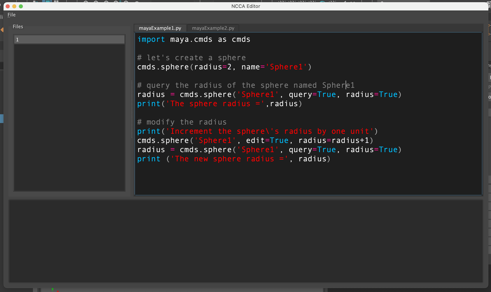

# Maya Editor

A work in progress replacement for the Maya Script Editor

Written in Python 3 so will only work with more modern version of Maya testing on Maya 2023 using PySide2 

See [TODO.md](TODO.md) for roadmap

Testest