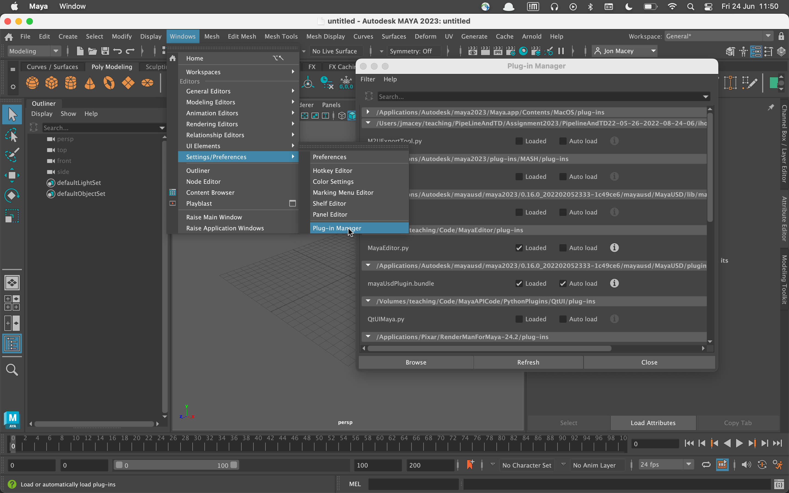

# Maya Editor


A work in progress replacement for the Maya Script Editor

Written in Python 3 so will only work with more modern version of Maya testing on Maya 2023 using PySide2 

See [TODO.md](TODO.md) for roadmap

## Installing

There is a simple python script to install and create the module file for the maya plugin. This is in the root of the project folder and is called installEditor.py. This will locate the modules folder for the OS and generate the file MayaEditor.mod. This file is located in the Users home folder in one of the following locations.

- Linux : $HOME/maya
- Mac : $HOME/Library/Preferences/Autodesk/maya
- Windows  %HOMEPATH%\\Documents\\maya\\


If this install doesn't work you can edit the provided file and modify the path to the correct locations

```
+ MayaEditor 1.0 /Users/jmacey/teaching/Code/MayaEditor
MAYA_PLUG_IN_PATH +:= plug-ins
```

## Loading 

The plugin can be loaded from the plugin manager as shown



The editor will auto load and display. If you close the window it can be re-opened using the following code

```
import maya.cmds as cmds
cmds.MayaEditor()
```


